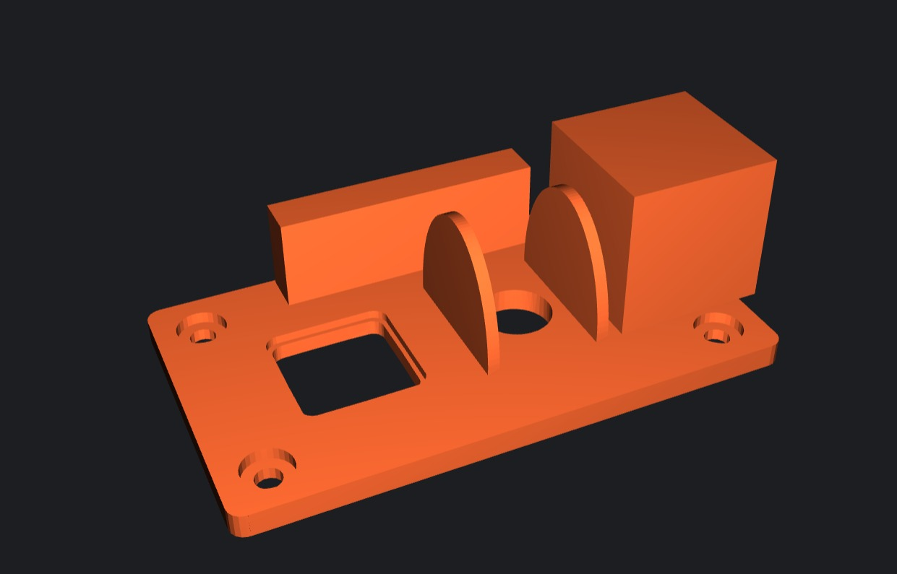
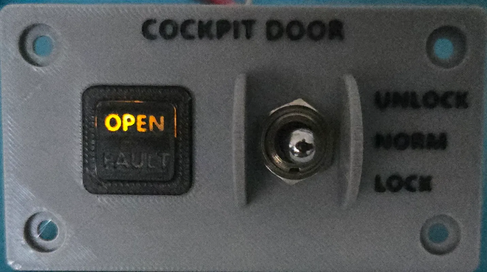

# A3xx Door Lock Panel - 3D Print Files

Questo repository contiene i modelli 3D e i file di slicing necessari per stampare e costruire il **Door Lock Panel** di un aeromobile della serie Airbus A3xx (es. A320). Questo progetto è pensato per gli appassionati di simulazione di volo (Flight Simulators) e costruttori di home cockpit.

## 📂 Struttura del Repository

Il progetto include i seguenti file pronti per la stampa e la consultazione:

- **Modelli 3D:**
  - `A3xx Door Lock Panel.stl`: Il modello principale del pannello, pronto per essere importato nel tuo slicer preferito.
  - `cockpit-door-lens-pp.3mf`: File di progetto 3MF per le lenti del pannello (consigliata la stampa con filamento traslucido/trasparente per permettere la retroilluminazione).
- **File G-Code (Pronti per la stampa):**
  - `A3xx Door Lock Panel.gcode`
  - `cockpit-door-lens-pp.gcode`
  *(Nota: Si consiglia sempre di generare il proprio G-Code a partire dai file STL/3MF per adattarli alla propria stampante e al proprio filamento).*
- **Immagini di Riferimento:**
  - `images/A3xx Door Lock Panel.jpeg`
  - `images/cockpit-door.webp`

## 🖨️ Consigli per la Stampa 3D

Per ottenere i migliori risultati, si consigliano le seguenti impostazioni di stampa:

*   **Materiale:** PLA, PETG o ABS (il PETG è consigliato se il pannello sarà esposto a calore generato dall'elettronica/LED).
*   **Altezza Layer:** 0.16mm o 0.20mm per un buon compromesso tra qualità e velocità.
*   **Riempimento (Infill):** 15% - 20% (Gyroid o Grid).
*   **Supporti:** Valutare in base all'orientamento del pezzo nello slicer.
*   **Lenti:** Per il file `cockpit-door-lens-pp.3mf`, si consiglia di utilizzare PLA o PETG trasparente/bianco latte, con un riempimento al 100% per diffondere al meglio la luce dei LED.

## 🛠️ Assemblaggio ed Elettronica (WIP)

*Aggiungi qui i dettagli sull'hardware necessario, ad esempio:*
*   Interruttori a levetta (Toggle switches)
*   LED per la retroilluminazione (es. strisce LED 12V/5V o LED singoli)
*   Scheda di interfaccia (es. Arduino Mega con MobiFlight, Pokeys, ecc.)

## 📸 Galleria

*(Puoi inserire qui i link alle tue immagini per mostrarle direttamente nel README)*

## 📄 Licenza

Questo progetto è distribuito sotto licenza [MIT / Creative Commons] - *Modifica in base alle tue preferenze di condivisione.*